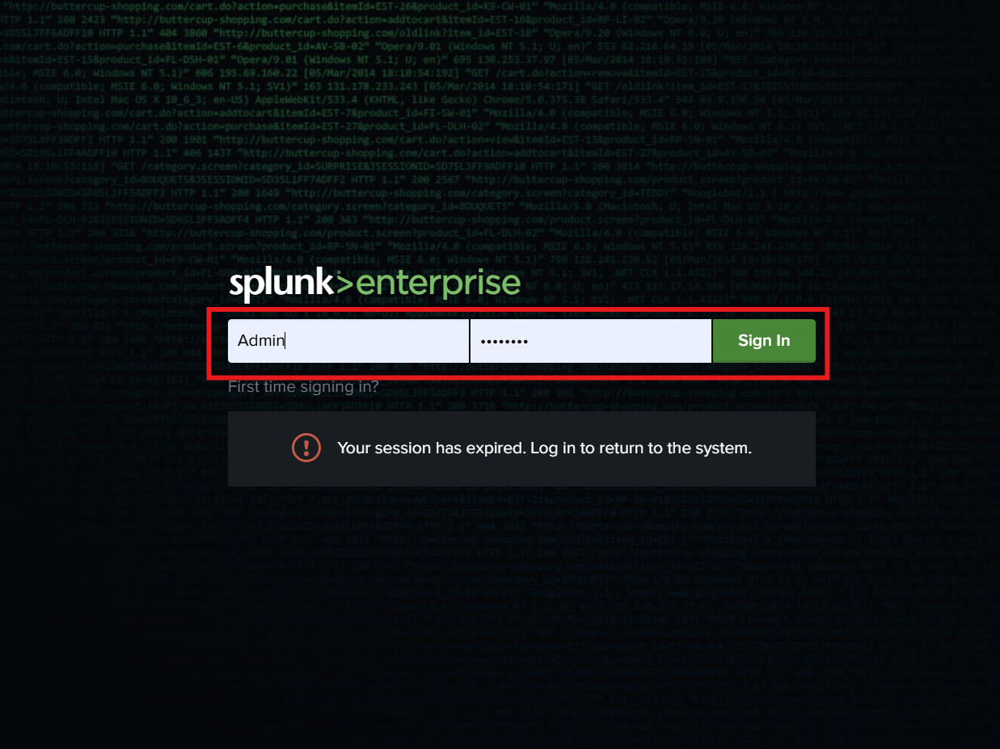
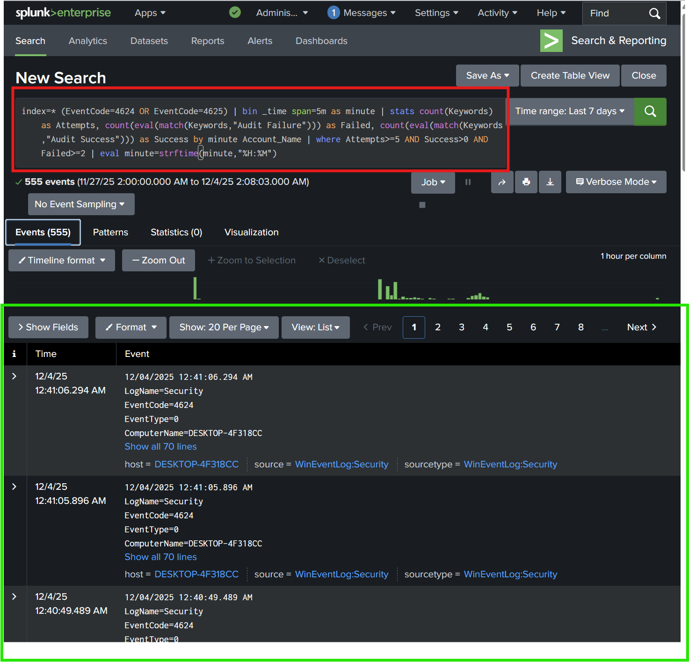
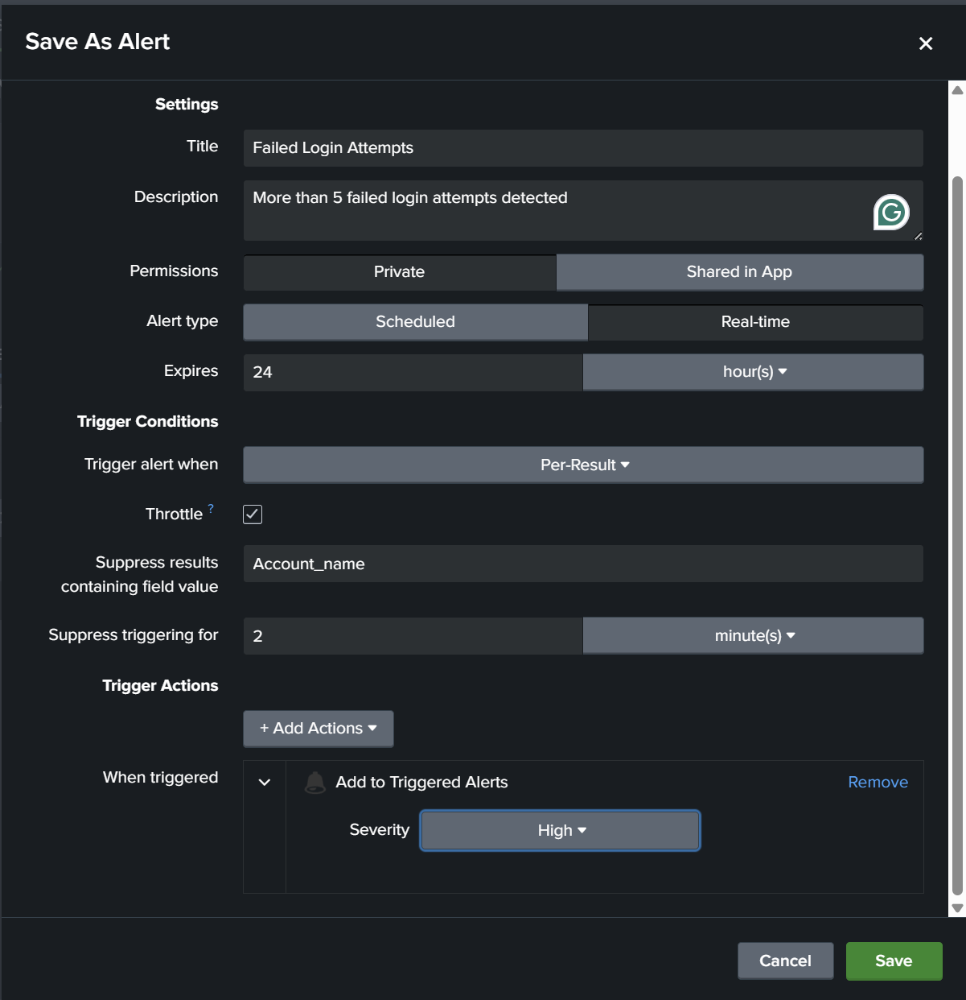

Understanding Logs, Events, and Incidents

Windows Security Logs are one of the main sources for detecting brute-force behavior. When you start seeing a pattern of multiple failed logins followed by a success, that’s usually a sign that someone is trying to guess credentials.

As a SOC analyst, your job is to know what events to monitor, where they come from, and how to create alerts that help you catch these attempts early.

Objective

Create a Splunk use case that detects a user failing to log in more than five times, and then eventually logging in successfully. The alert should fire in real-time.

Environment & Tools

Windows Server 2012 (Target / Log Source)

Kali Linux (Attacker Machine)

Windows 10 (Splunk Server)

Splunk Universal Forwarder (Log forwarding)

Splunk Enterprise SIEM

Steps Taken
1. Login to Splunk

Sign in to Splunk using:

Username: admin

Password: yourpassword

From the sidebar, select Search & Reporting.

2. Search for Login Events (4624 & 4625)

In the Splunk search box, I ran this query:

index=* (EventCode=4624 OR EventCode=4625)
| bin _time span=5m as minute
| stats count(Keywords) as Attempts,
        count(eval(match(Keywords,"Audit Failure"))) as Failed,
        count(eval(match(Keywords,"Audit Success"))) as Success
        by minute Account_Name
| where Attempts>=5 AND Success>0 AND Failed>=2
| eval minute=strftime(minute,"%H:%M")

Purpose:

Detect accounts with high failed login attempts within 5 minutes.

Check if a successful login eventually occurred.

Filter out noise by setting thresholds (Attempts ≥5).

3. Convert Query Into an Alert

Click Save As → Alert.

Filled in the alert details:

Title: Failed Login Attempts

Description: More than 5 failed login attempts detected

Alert Type: Real-time

Permissions: Private

4. Throttling (Avoid too many alerts)

Enabled Throttle

Suppress based on Account_Name

Duration: 2 minutes

5. Add Action

Selected Add to Triggered Alerts

Severity: High

Saved the alert.

6. Triggering the Brute Force Attack

Over on the Kali machine:

Ran Hydra against the Windows Server:

hydra -L /root/Wordlist/userlist.txt -P /root/Wordlist/pass.txt ftp://192.168.0.186

Hydra cycles through username/password pairs.
This generates EventCode 4625 (failed logins).

After Hydra finds valid credentials, I manually logged into FTP using:

ftp 192.168.0.186
username: administrator
password: Pa$$w0rd

This generates EventCode 4624 (successful login).

This combination should trigger the Splunk alert.

7. Confirming the Alert

Back in Splunk:

Went to Activity → Triggered Alerts

The alert fired as expected.

Opened View Results to review all fields from the detection.

Results

The detection successfully fired when Hydra caused multiple failed logins, followed by a valid login.
This confirmed that the use case correctly identifies brute-force behavior.
