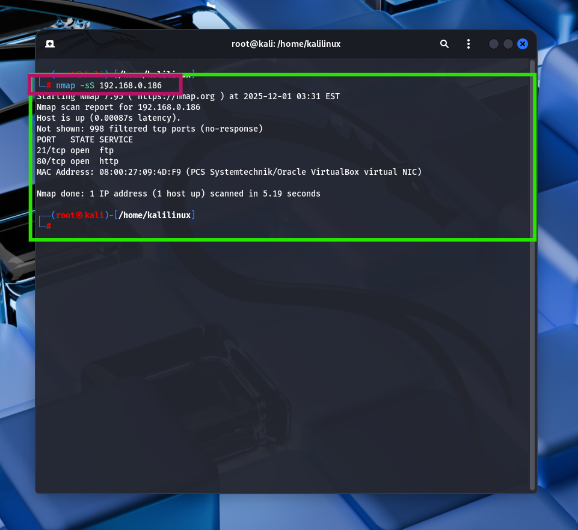
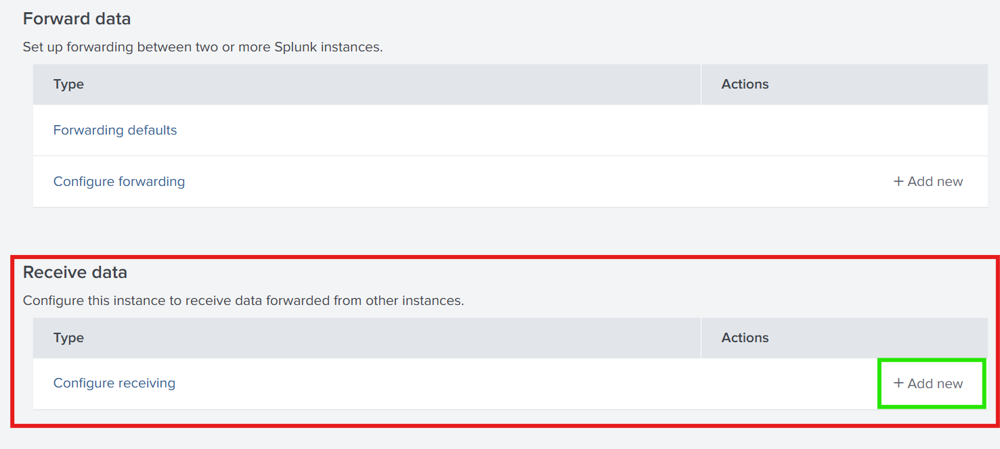
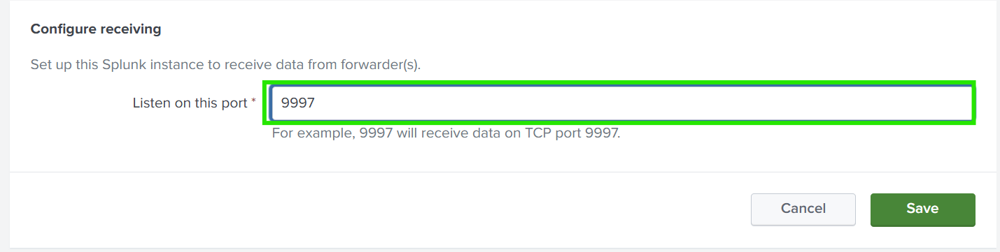
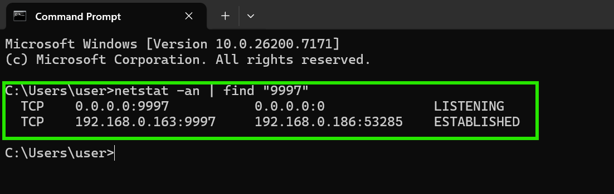

# 

**Objective:** Install Splunk Enterprise on a host machine and configure it to receive data from Universal Forwarders.

---

## 1. Download and Install Splunk Enterprise

1. Download the latest **Splunk Enterprise** installer for your OS from:
    
    https://www.splunk.com/en_us/download/splunk-enterprise.html
    
2. Run the installer and follow the prompts. Choose the installation directory (default: `C:\Program Files\Splunk`).
3. Start Splunk Enterprise:
    - Windows: Start Splunk service from Start Menu or `services.msc`.
    - Linux: Run `sudo systemctl start splunk` or `./splunk start`.
4. Log in to Splunk Web:
    
    ```
    http://<host-ip>:8000 (127.0.0.1:8000)
    
    ```
    
    Default username: `admin`
    
    Default password: you set during installation.
    

**Screenshot:**



---

## 2. Enable Receiving on Splunk Enterprise

1. In Splunk Web, navigate to:
    
    ```
    Settings → Forwarding and receiving → Receive data → New Receiving Port
    
    ```
    





1. Add **Port 9997** (default for Universal Forwarders).
2. Click **Save**. Splunk Enterprise is now ready to accept data from forwarders.
3. Verify the listener:
    
    ```bash
    netstat -an | find "9997"
    
    ```
    
    You should see `LISTENING` on the host IP.
    

**Screenshot:**

(*You can see all your VM forwarding to the port 9997*)



---

## 3. Optional: Test Forwarder Connectivity

- Once a forwarder is installed on another machine, check **Active Forwarders**:
    
    ```bash
    splunk list forward-server
    
    ```
    
    It should show your host IP with port `9997` as **Active**.
    

**Screenshot:**


