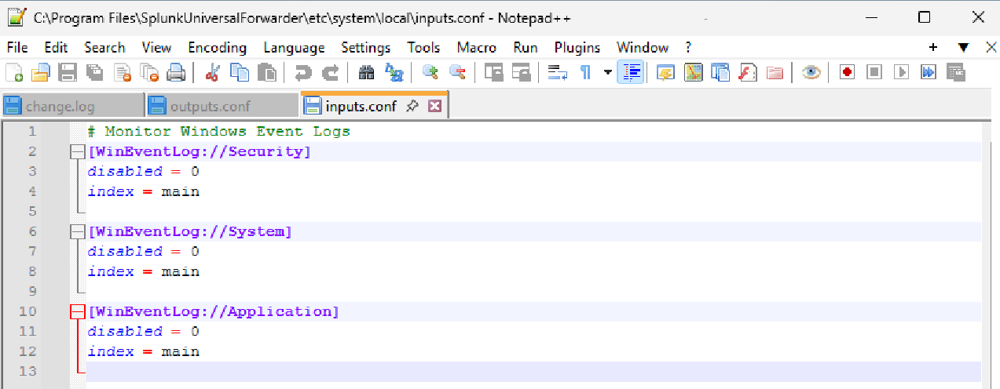
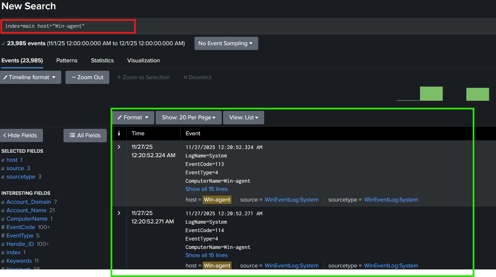

## Lab Objective

Forward Windows Event Logs (Security, System, Application) from a Windows VM to Splunk Enterprise and verify the logs are indexed properly.

---

## 1. Environment Setup

- **Splunk Enterprise**: Installed on host machine
- **Windows VM**: Running Windows 11, hostname: `Win-agent`
- **Network**: Both host and VM on same subnet (e.g., `192.168.0.x`)

---

## 2. Install Splunk Universal Forwarder on Windows VM

1. Download Splunk Universal Forwarder from [Splunk Downloads](https://www.splunk.com/en_us/download/universal-forwarder.html).

1. Run installer on Windows VM.
2. During installation:
    - Default installation path: `C:\Program Files\SplunkUniversalForwarder`
    - Enable Splunk service to run automatically.

---

## 3. Configure Forwarder to Send Data to Splunk Enterprise

1. Determine **host machine IP** (Splunk Enterprise server). Use `ipconfig` on host:
    
    ```
    Wireless LAN adapter Wi-Fi:
        IPv4 Address: 192.168.0.163
    
    ```
    
    Use this IP for forwarder configuration.
    
2. Open **CMD as Administrator** on VM and run:
    
    ```bash
    cd "C:\Program Files\SplunkUniversalForwarder\bin"
    splunk login
    
    ```
    
    Enter Splunk credentials (admin / password).
    
3. Add the Splunk Enterprise server as forward-server:
    
    ```bash
    splunk add forward-server 192.168.0.163:9997
    
    ```
    
    - Replace `192.168.0.163` with host machine IP.
    - Port `9997` is default for receiving forwarded data.
4. Restart the forwarder:
    
    ```bash
    splunk restart
    
    ```
    

**Screenshot:**


---

## 4. Configure Event Log Inputs

1. Create or edit `inputs.conf` at:
    
    ```
    C:\Program Files\SplunkUniversalForwarder\etc\system\local\inputs.conf
    
    ```
    
2. Add the following to monitor Windows Event Logs:
    
    ```
    [WinEventLog://Security]
    disabled = 0
    index = main
    
    [WinEventLog://System]
    disabled = 0
    index = main
    
    [WinEventLog://Application]
    disabled = 0
    index = main
    
    ```
    
3. Restart the forwarder again to apply changes:
    
    ```bash
    splunk restart
    
    ```
    

**Screenshot:**

*(inputs.conf content screenshot here)*



---

## 5. Verify Data on Splunk Enterprise

1. Go to Splunk Web: `http://<host-ip>:8000` (e.g., `http://192.168.0.163:8000`)
2. Navigate to **Search & Reporting**.
3. Run search to confirm logs are being received:
    
    ```
    index=main host="Win-agent"
    
    ```
    
4. Check that Security, System, and Application logs appear (Event IDs 4624, 4627, 4672, etc.).

**Screenshot:**




Conclusion:
