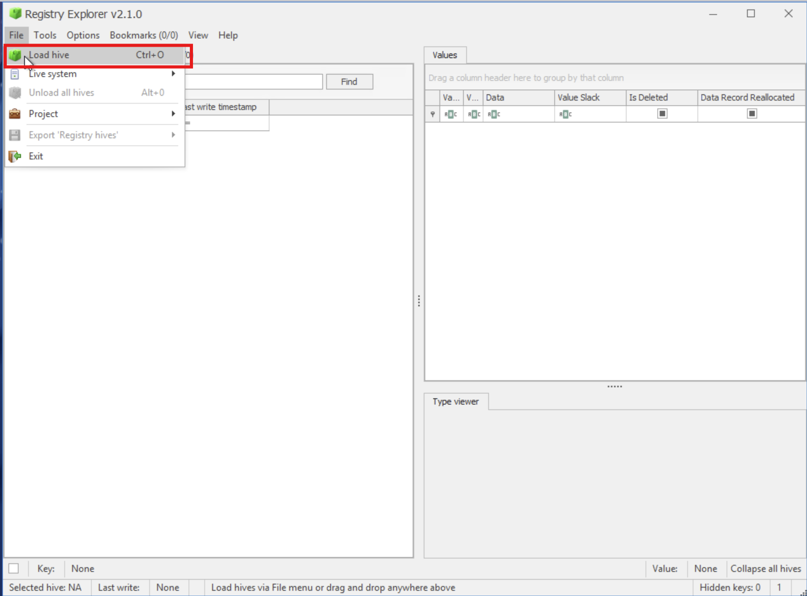

**Windows Registry Forensics – Dispatch-SRV01 Investigation**

**Objective**

Investigate abnormal activity on dispatch-srv01 by analyzing offline Windows Registry hives to identify:

Suspicious application installation

Execution source path

Persistence mechanism added by the application

This investigation was conducted offline to preserve evidence integrity.

**Tools Used**

Registry Explorer (Eric Zimmerman)

Offline Registry Hives:

SYSTEM

SOFTWARE

NTUSER.DAT

Evidence Source

Registry hives collected from the compromised host and provided at:

C:\Users\Administrator\Desktop\Registry Hives

Abnormal activity timeframe:

Started: 21 October 2025

Investigation Workflow

**1. Loading Offline Registry Hives**

All registry analysis was performed offline using Registry Explorer.

Steps:

Open Registry Explorer

File → Load Hive

Hold SHIFT + Open to replay transaction logs (clean hive state)

Loaded hives:

SYSTEM

SOFTWARE

NTUSER.DAT

📸 Screenshot: Registry Explorer with loaded hives

Findings
Finding 1: Suspicious Application Installed

Hive Analyzed: SOFTWARE

Registry Path:

HKLM\SOFTWARE\Microsoft\Windows\CurrentVersion\Uninstall

Action Taken:

Reviewed installed applications around the abnormal activity date

Identified an unfamiliar application installed shortly before suspicious behavior began

Result:

Application identified: DroneManager Updater

📸 Screenshot: Uninstall registry key showing DroneManager Updater

Finding 2: Application Execution Source

Hive Analyzed: NTUSER.DAT

Registry Path:

HKCU\Software\Microsoft\Windows\CurrentVersion\Explorer\UserAssist

Action Taken:

Reviewed UserAssist entries to determine how the application was executed

Decoded ROT13 UserAssist values

Correlated execution timestamp with abnormal activity window

Result:

Application launched from:

C:\Users\dispatch.admin\Downloads\DroneManager_Setup.exe

This confirms user-initiated execution from the Downloads directory, not a system-managed install.

📸 Screenshot: UserAssist entry showing execution path

Finding 3: Persistence Mechanism Identified

Hive Analyzed: SOFTWARE

Registry Path:

HKLM\SOFTWARE\Microsoft\Windows\CurrentVersion\Run

Action Taken:

Reviewed autorun keys for newly added startup entries

Focused on entries linked to DroneManager components

Result:

Persistence value added:

"C:\Program Files\DroneManager\dronehelper.exe" --background

This confirms startup persistence via Run key, ensuring execution on system boot.

📸 Screenshot: Run key persistence entry

Confirmed Answers (Lab Validation)
Question	Answer
Application installed before abnormal activity	DroneManager Updater
Full execution path	C:\Users\dispatch.admin\Downloads\DroneManager_Setup.exe
Persistence mechanism	"C:\Program Files\DroneManager\dronehelper.exe" --background
Analyst Assessment

Application was manually executed by the user

Installed from an untrusted location (Downloads)

Established registry-based persistence

Activity aligns with initial access → execution → persistence

This behavior is consistent with user-assisted malware installation or trojanized software.

Skills Demonstrated

Offline registry hive analysis

Identifying malicious software via Uninstall keys

Tracking execution via UserAssist artifacts

Detecting persistence through Run keys

Timeline-based investigation using registry artifacts

Evidence handling without altering source system
