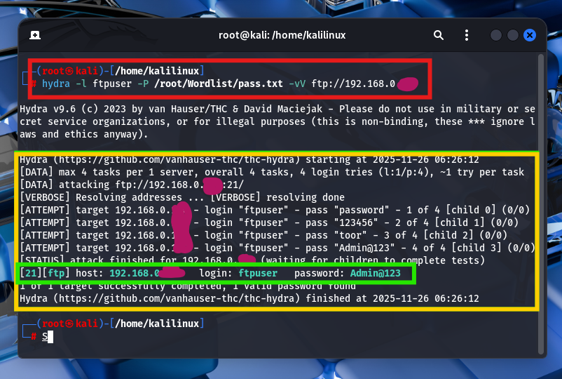

# **Windows Security Logging & Brute Force Detection**

## **Overview**

This lab demonstrates configuring Windows security audit policies, generating brute force login attempts, and analyzing the resulting event logs.

The goal is to showcase the ability to detect unauthorized login attempts using Windows Event Viewer.

---

## **Lab Environment**

- **Target OS:** Windows Server 2012 / 2022
- **Attack Machine:** Kali Linux
- **Tools Used:** Hydra, FTP client, Event Viewer
- **Key Configurations:**
    - Audit policy enabled for **Success** and **Failure** logon events
    - FTP server configured for testing login attempts

---

## **Lab Objectives**

1. Enable auditing for successful and failed logins in Windows.
2. Generate logs using brute force login attempts via Hydra.
3. Analyze Windows Event Viewer logs to detect and interpret attack activity.

---

## **1. Configure Windows Audit Policy**

**Steps Taken:**

1. Open **Local Security Policy** → **Local Policies** → **Audit Policy**.
2. Double-click **Audit logon events**.
3. Enable both **Success** and **Failure** checkboxes.
4. Apply and close the policy window.

**Screenshot:**


---


## **2. Generate Brute Force Attempts**

**Steps Taken:**

1. Launch Kali Linux.
2. Open terminal and run:

```bash
hydra -L /root/Wordlist/userlist.txt -P /root/Wordlist/pass.txt ftp://<target_IP>

```
1. Record login attempts and capture successful credentials.

**Screenshot:**



---

## **3. Analyze Windows Event Logs**

**Steps Taken:**

1. Open **Event Viewer** → **Windows Logs** → **Security**.
2. Filter **Event ID 4625** to view failed login attempts.
3. Check **Target Username** and **Source IP** to correlate with attack.

**Screenshot:**


---


## **Results**

- Number of failed login attempts: *(insert number)*
- Successful login found: *(username/password if applicable)*
- Source IP of attacks: *(insert Kali IP)*

---

## **Insights & Learning Points**

- Audit policies effectively record both success and failure login attempts.
- Event Viewer can be used to trace brute force attempts and correlate attack details.
- Understanding log structure is crucial for incident detection and response.
